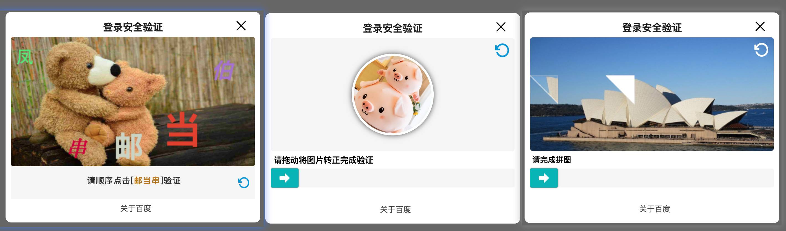

# mingleVcode-ts



基于TypeScript的验证码生成模块，提供简单、可靠且易于集成的验证码解决方案。

## 🌟 特性

- 🚀 基于TypeScript开发，提供完整的类型支持
- 🎨 支持多种验证码样式和自定义配置
- 🔒 安全可靠的验证机制
- 🔧 易于集成和使用
- ⚡️ 基于Webpack 4构建，确保稳定性
- 📦 支持模块化引入
- 🛠 提供完整的开发环境

## 📦 项目结构

```
mlVocdeProject/
├── vcode/                # 前端验证码模块
│   ├── src/             # 源代码目录
│   │   ├── api/        # API接口
│   │   ├── config/     # 配置文件
│   │   ├── enum/       # 枚举定义
│   │   ├── interface/  # 接口定义
│   │   ├── static/     # 静态资源
│   │   ├── utils/      # 工具函数
│   │   ├── main.ts     # 入口文件
│   │   └── global.d.ts # 全局类型声明
│   ├── webpack.config.js # Webpack配置
│   └── tsconfig.json    # TypeScript配置
└── server/              # 后端服务
```

## 🚀 快速开始

### 环境要求

- Node.js >= 16.0.0
- Yarn >= 1.22.0

### 安装步骤

1. 克隆项目
```bash
git clone git@github.com:mingle98/machine-vcode-ts.git
cd mingleVcode-ts
```

2. 安装依赖
```bash
cd mlVocdeProject/vcode
yarn install
```

3. 启动开发服务器
```bash
yarn serve
```
服务器将在 http://localhost:3000 启动

4. 构建生产版本
```bash
yarn build
```

## 💻 开发指南

### 开发命令

- `yarn serve`: 启动开发服务器
- `yarn build`: 构建生产版本
- `yarn dev`: 以开发模式启动（无自动打开浏览器）

### 目录说明

- `src/api`: API接口封装
- `src/config`: 项目配置文件
- `src/enum`: 枚举类型定义
- `src/interface`: TypeScript接口定义
- `src/static`: 静态资源文件
- `src/utils`: 工具函数集合

### 配置文件

- `webpack.config.js`: Webpack构建配置
- `tsconfig.json`: TypeScript编译配置
- `tslint.json`: TypeScript代码规范配置

## 🔧 使用方法

### 基础使用

1. 引入构建后的文件：
```html
<script src="path/to/api/built.js"></script>
```

**温馨提示**: 如果希望使用在线的built.js请参考以下这个使用文档: [https://luckycola.com.cn/public/docs/shares/sdk/ml-vcodes.html](https://luckycola.com.cn/public/docs/shares/sdk/ml-vcodes.html)


2. 初始化验证码：
```html
<div id="myVcodeContainer"></div>
<script>
window.onload = function() {
    const mlVcode = boostrapFn({
        // 验证码类型：支持点选验证码(clickVcode)、转图验证码(roateVcode)和拼图验证码(puzzleVcode)
        vcodeType: ['puzzleVcode', 'clickVcode', 'roateVcode'],
        // 模式：dialog(弹窗模式) 或 不填(嵌入模式)
        mode: 'dialog',
        // 验证码容器ID
        container: '#myVcodeContainer',
        // 是否开启服务端验证（默认false）
        serverVerify: false,
        // 成功回调
        successFn: (rsp) => {
            console.log('验证成功');
        },
        // 失败回调
        failFn: (rsp) => {
            console.log('验证失败');
        }
    }).render();
}
</script>
```

### 高级配置

#### 点选验证码配置
```javascript
clickVcodeConfig: {
    // 验证码文字
    fontList: '姐姐姐姐姐姐介绍岁',
    // 背景图片列表（URL数组）
    imgList: []
}
```

#### 拼图验证码配置
```javascript
puzzleVcodeConfig: {
    // 拼图形状：'puzzle' | 'rect' | 'round' | 'triangle'
    puZshape: 'puzzle',
    // 提示文案
    puZoperateTip: '请拖动完成拼图验证',
    // 背景图片列表（URL数组）
    puZimgList: []
}
```

#### 转图验证码配置
```javascript
roateVcodeConfig: {
    // 提示文案
    roateOperateTip: '请拖动将图片转正完成验证',
    // 图片列表（URL数组）
    roateimgList: []
}
```

#### 自定义界面文案
```javascript
customTxt: {
    // 标题配置
    headerConfig: {
        text: '安全验证',
        url: 'https://your-website.com'
    },
    // 底部配置
    footerConfig: {
        text: '关于我们',
        url: 'https://your-website.com/about'
    }
}
```

### 服务端验证配置

如果需要开启服务端验证（serverVerify = true），可以通过以下配置自定义验证接口：

```javascript
collectionDataOptios: {
    // 开启自定义服务端验证接口
    open: true,
    // 数据上报接口（POST）
    postUrl: '/api/mlvcode',
    // 数据上报回调
    postUrlFn: function(resData) {
        console.log('数据上报响应:', resData);
    },
    // 初始化接口（POST）
    initpostUrl: '/api/initmlvcode',
    // 初始化接口回调
    postInitUrlFn: function(initSuccessHook, resData) {
        if (resData.data.code === 0) {
            initSuccessHook();
        }
    },
    // 验证接口（POST）
    verifypostUrl: '/api/verify',
    // 验证接口回调
    verifypostUrlFn: function(resData, verifySuccessHook, verifyFailHook) {
        if (resData.data.code === 0) {
            verifySuccessHook();
        } else {
            verifyFailHook();
        }
    },
    // 请求参数前置处理
    apiDataPreFn: function(apiData) {
        // 可以在这里对请求参数进行加密等处理
        return apiData;
    }
}
```

### 在线演示

访问 [在线演示](http://demo.luckycola.com.cn/mlvcode/index.html) 查看验证码效果。

## 🤝 贡献指南

我们非常欢迎社区贡献！如果您想为项目做出贡献，请：

1. Fork 本仓库
2. 创建您的特性分支 (`git checkout -b feature/AmazingFeature`)
3. 提交您的更改 (`git commit -m 'Add some AmazingFeature'`)
4. 推送到分支 (`git push origin feature/AmazingFeature`)
5. 开启一个 Pull Request

### 贡献前须知

- 确保代码符合TypeScript规范
- 添加必要的注释和文档
- 确保所有测试通过
- 遵循现有的代码风格

## 📝 版本历史

- v1.0.0 - 初始版本发布
  - 基础验证码生成功能
  - TypeScript支持
  - Webpack 4构建支持

## 📄 许可证

本项目采用 MIT 许可证 - 查看 [LICENSE](LICENSE) 文件了解详情

## 👨‍💻 作者

- @mingleZhou

## 🙏 致谢

感谢所有为这个项目做出贡献的开发者！

## 📮 联系方式

如有问题或建议，欢迎提出 Issue 或 Pull Request。

## 🔗 相关链接

- [项目主页](https://github.com/mingle98/machine-vcode-ts)
- [问题反馈](https://github.com/mingle98/machine-vcode-ts/issues)
- [更新日志](CHANGELOG.md)
